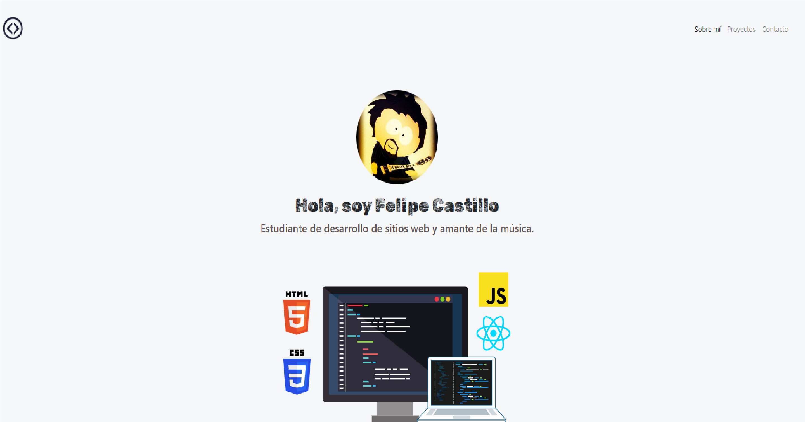
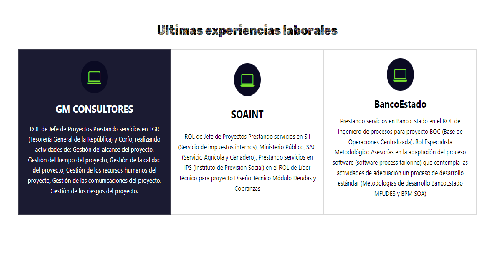
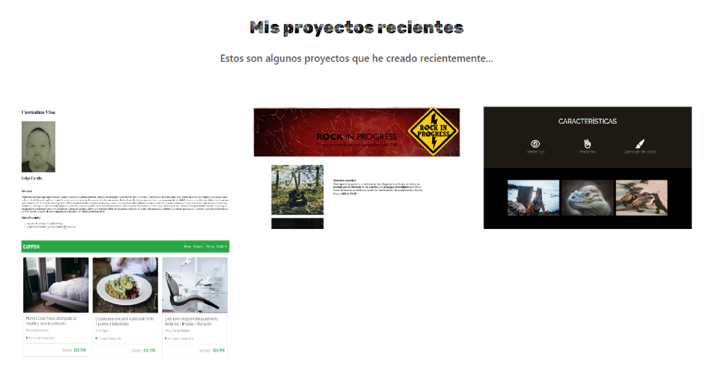
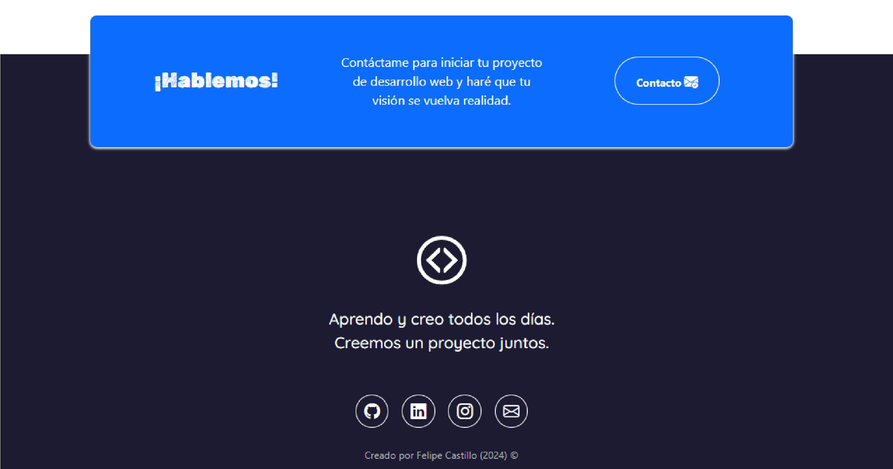

# Portafolio Adaptable (Responsive) con Bootstrap 5

Este proyecto creado para el curso Desarrollo Full Stack JavaScript impartido por Desafío Latam. Es una página web adaptable a dispositivos de distintos tamaños (este tipo de sitio web se conoce en inglés como "responsive"). 

El propósito de esta página web es mostrar el portafolio de proyectos de un desarrollador y su experiencia. Incluye una descripción breve de su motivación, experiencia, proyectos y formas de contacto. 

### Capturas de pantalla:

Primera parte de la página web:

Experiencia:

Proyectos:

Contacto:

## Tecnologías

Esta página web fue creada con:

* HTML
* CSS
* Bootstrap 5

Además, se incluyeron **Google Fonts** para personalizar la fuente y **Bootstrap icons** para incorporar íconos como flechas y logos de redes sociales populares. 

## Proyecto

Puedes acceder al proyecto en: https://pipemerken.github.io/

